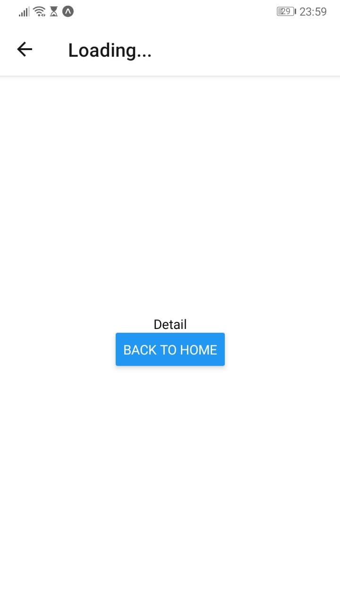

# react-native-navigation
Navigation system inside React Native

````bash
$ expo init react-native-navigation
$ expo install react-navigation react-native-gesture-handler react-native-reanimated react-native-screens
````


react-navigation has 3 child dependencies:

* `react-navigation` - navigation system
  * `react-native-gesture-handler` - makes the gestures system better
  * `react-native-reanimated` - makes fluent animation
  * `react-native-screens` - direct dependency
  
  

There are 4 types available

* Stack
* Tabs
* Drawer
* Switch

**Stack:** Consists in stack all the menus available like in an array, as on history mode, so we will be able to come back following our last steps.

**Tabs:** The usual mobile phone layout, with a bottom bar with tabs to click and switch the content of the screen.

**Drawer:** Almost equal to tabs, but collapsable. Used in vertical menus.

**Switch:** Moves to a new route and drops everything in memory about last screens. Used for example, to move from the login screen to the home.

````
SCHEME EXAMPLE: The login moves us throw a [switch] to the home page, which contains a [tabs] system with 2 [stack] menu and one [drawer]

LOGIN
  | (switch)
  ---> HOME (stack) (drawer)

````


## 1 - Stack navigation

`$ yarn add react-navigation-stack`

````jsx
// App.js
import { createAppContainer } from 'react-navigation'
import { createStackNavigator } from 'react-navigation-stack'
````

>  Note: `createAppContainer ` must be declared on the top of the components, in the root of our project to wrap all the system.


### 1.1 - Configuring the basic navigation

````jsx
import React from 'react'
import { StyleSheet, Text, View, Button } from 'react-native'
import { createAppContainer } from 'react-navigation'
import { createStackNavigator } from 'react-navigation-stack'

// Screen 1
const HomeScreen = ({ navigation }) => {
	return (
		<View style={styles.container}>
			<Text>Home</Text>
			<Button
				title="Go to detail"
				onPress={() => navigation.push('Detail')}
			/>
	  	</View>
	)
}

// Screen 2
const DetailScreen = ({ navigation }) => {
	return (
		<View style={styles.container}>
			<Text>Detail</Text>
			<Button
				title="Back to home"
				onPress={() => navigation.goBack()}
			/>
	  	</View>
	)
}

// Stack navigation defined
const AppNavigator = createStackNavigator({
	Home: {
		screen: HomeScreen
	},
	Detail: {
		screen: DetailScreen
	}
}, { initialRouteName: 'Home' })

export default createAppContainer(AppNavigator)

const styles = StyleSheet.create({
  container: {
    flex: 1,
    backgroundColor: '#fff',
    alignItems: 'center',
    justifyContent: 'center',
  },
})
````


The "problem" here is that when we do `onPress={() => navigation.hoBack()}` we are unmounting the last screen and coming back. So we lost the data.

If we want to move from one screen to another sharing data between them, we need to change our moving system from `navigation.push()` to `navigation.navigate()`

Example:

```jsx
import React from 'react'
import { StyleSheet, Text, View, Button } from 'react-native'
import { createAppContainer } from 'react-navigation'
import { createStackNavigator } from 'react-navigation-stack'

// Screen 1
const HomeScreen = ({ navigation }) => {
	return (
		<View style={styles.container}>
			<Text>Home</Text>
			<Button
				title="Go to detail"
				// As second argument, recieves an object, the data
				onPress={() => navigation.navigate('Detail', { user_name: 'Joanne', user_id: 2 })}
			/>
	  	</View>
	)
}

// Screen 2
const DetailScreen = ({ navigation }) => {

	// And in the other screen, with the function getParam() we fetch the data, 
	// and optionally asigning a default value as second parameter
	const user = navigation.getParam('user_name', 'defaultvalue')

	return (
		<View style={styles.container}>
			<Text>Detail</Text>
			<Button
				title="Back to home"
				onPress={() => navigation.goBack()}
			/>
	  	</View>
	)
}

// Stack navigation defined
const AppNavigator = createStackNavigator({
	Home: {
		screen: HomeScreen
	},
	Detail: {
		screen: DetailScreen
	}
}, { initialRouteName: 'Home' })

export default createAppContainer(AppNavigator)

const styles = StyleSheet.create({
  container: {
    flex: 1,
    backgroundColor: '#fff',
    alignItems: 'center',
    justifyContent: 'center',
  },
})
```


### 1.2 - Modifying the navbar

To modify the default name of the navbar, we will use `navigationOptions` property

````jsx
const DetailScreen = ({ navigation }) => {
	return (
		<View style={styles.container}>
			<Text>Detail</Text>
			<Button
				title="Back to home"
				onPress={() => navigation.goBack()}
			/>
	  	</View>
	)
}

DetailScreen.navigationOptions = {
	title: 'Second page'
}
````

That will modify the view to show the correct title that we defined there, `'Second Page'`.


But what if we want to make that title to load dynamically? Then we need to modify a little that property.

````jsx
DetailScreen.navigationOptions = ({ navigation }) => {
	return {
		title: navigation.getParam('title', 'Loading...')
	}
}
````

This will allow to fetch a title with the `.getParam()` function we already know. And also pass a default value as second argument.

For now, because we didn't define any `'title'` property to load, we will get a `'Loading...'` as title. So to get a dynamic title, we need to define in our another screen (Home) the data

````jsx
const HomeScreen = ({ navigation }) => {
	return (
		<View style={styles.container}>
			<Text>Home</Text>
			<Button
				title="Go to detail"
				// As second argument, recieves an object, the data
				onPress={() => navigation.navigate('Detail', { title: 'Dynamic title', user_id: 2 })}
			/>
	  	</View>
	)
}
````

That will allow our `.getParam` to load the property `title` and show the correct one. Here there are the 3 screens showing the changes.




And can the screen modify his own title? Sure! Just use `.setParams()`

```jsx
const DetailScreen = ({ navigation }) => {

	return (
		<View style={styles.container}>
			<Text>Detail</Text>
			<Button
				title="Back to home"
				onPress={() => navigation.setParams({ title: 'Modified'})}
			/>
	  	</View>
	)
}
```

That would modify our current title `'Loading...'` or `'Dynamic title'` to `'Modified'`


### 1.3 - Styling the navbar

We can style the navbar modifying the `.navigationOptions`

````jsx
// Dark background, text white, font weight
HomeScreen.navigationOptions = {
	title: 'Home page',
	headerStyle: {
		backgroundColor: '#264653',
	},
	headerTintColor: '#fff',
	headerTitleStyle: {
		fontWeight: 'bold'
	}
}
// Red background, text white
DetailScreen.navigationOptions = ({ navigation }) => {
	return {
		title: navigation.getParam('title', 'Loading...'),
		headerStyle: {
			backgroundColor: '#e76f51'
		},
		headerTintColor: '#fff'
	}
}
````


So now we are defining 2 times our style, being different for each navbar screen. But what if we wanna have a default style for all the app?

Then we need to change our `createStackNavigator()`. Remember how it was until now:

````jsx
const AppNavigator = createStackNavigator({
	Home: {
		screen: HomeScreen
	},
	Detail: {
		screen: DetailScreen
	}
}, {initialRouteName: 'Home' })
````

So now we gonna add `defaultNavigationOptions`

````jsx
const AppNavigator = createStackNavigator({
	Home: {
		screen: HomeScreen
	},
	Detail: {
		screen: DetailScreen
	}
}, {
	initialRouteName: 'Home',
	defaultNavigationOptions: {
		headerStyle: {
			backgroundColor: '#264653',
		},
		headerTintColor: '#fff',
		headerTitleStyle: {
			fontWeight: 'bold'
		}
	}
})
````

That will make those options the default styling of our navbars. We could overwrite them in each screen with the `navigationOptions` system we saw before.


### 1.4 - Modify navbar content

To replace the navbar title with a component (pe. an image):

```jsx
HomeScreen.navigationOptions = {
    headerTitle: <Logo/>
}
```


And to add content in the right part of the header (like a button for example):

````jsx
useEffect(() => {
    navigation.setParams({ incrementar })
}, [state])

HomeScreen.navigationOptions = ({ navigation, navigationOptions }) => {
    headerRight: (
    	<Button
        	onPress={navigation.getParam('function-parameter')}
            title="Press me"
        />
    )
}
````


## 2 - Tabs navigation

```shell
$ yarn add react-navigation-tabs
```

Basic usage

````jsx
const AppNavigator = createBottomTabNavigator({
	Home: {
		screen: HomeScreen
	},
	Detail: {
		screen: DetailScreen
	}
}, {
	initialRouteName: 'Home',
	defaultNavigationOptions: {
		
	}
})
````

Tabs styling with an object

````jsx
const AppNavigator = createBottomTabNavigator({
	Home: {
		screen: HomeScreen
	},
	Detail: {
		screen: DetailScreen
	}
}, {
	initialRouteName: 'Home',
	defaultNavigationOptions: {
		tabBarOptions: {
			activeTintColor: 'blue',
			inactiveTintColor: 'white',
			labelStyle: {
				fontSize: 15,
			},
			style: {
				backgroundColor: '#ccc'
			}
		}
	}
})
````

Tabs styling with a function, for more complex styling

`````jsx
const AppNavigator = createBottomTabNavigator({
	Home: {
		screen: HomeScreen
	},
	Detail: {
		screen: DetailScreen
	}
}, {
	initialRouteName: 'Home',
	defaultNavigationOptions: ({ navigation }) => ({
		tabBarOptions: {
			activeTintColor: navigation.state.routeName == 'Home' ? 'blue' : 'orange',
			inactiveTintColor: 'white',
			labelStyle: {
				fontSize: 15,
			},
			style: {
				backgroundColor: '#ccc'
			}
		}
	})
})
`````

Adding Icons

expo comes with a icon module for icon sets

````jsx
// All icons here: https://oblador.github.io/react-native-vector-icons/
import { Ionicons, MaterialIcons, FontAwesome } from '@expo/vector-icons'
````

There we can choose between more than 10 icon libraries and import them to our file

After that, we can use them in our tabs

````jsx
const AppNavigator = createBottomTabNavigator({
	Home: {
		screen: HomeScreen
	},
	Detail: {
		screen: DetailScreen
	}
}, {
	initialRouteName: 'Home',
	defaultNavigationOptions: ({ navigation }) => ({
		tabBarIcon: ({ focused, horizontal, tintColor }) => {
			const { routeName } = navigation.state
			let iconName
			if (routeName === 'Home') {
				iconName = `ios-information-circle${focused ? '' : '-outline'}`
			} else {
				iconName = 'ios-options'
			}
			return <Ionicons name={iconName} size={20} tintColor={tintColor} />
		},
		tabBarOptions: {
			activeTintColor: navigation.state.routeName == 'Home' ? 'blue' : 'orange',
			inactiveTintColor: 'white',
			labelStyle: {
				fontSize: 15,
			},
			style: {
				backgroundColor: '#ccc'
			}
		}
	})
})
````


## 3. Drawer navigation

Is a side section with a vertical menu

````shell
$ yarn add react-navigation-drawer 
````


````jsx
import { createDrawerNavigator } from 'react-navigation-drawer'
````

Usage: 

`````jsx
// Route 1
const HomeScreen = ({ navigation }) => {
	return (
		<>
			<Text>Home</Text>
			<Button
				title="Go to detail"
				onPress={() => navigation.openDrawer()}
			/>
	  	</>
	)
}
HomeScreen.navigationOptions = {
	drawerIcon: ({ tintColor }) => {
		return <Ionicons name='ios-information-circle' size={25} color={tintColor} />
	},
	headerTitle: 'Home',
	headerStyle: { backgroundColor: '#eee' }
}

// Route 2
const DetailScreen = ({ navigation }) => {
	return (
		<>
			<Text>Detail</Text>
			<Button
				title="Back to home"
				onPress={() => navigation.goBack()}
			/>
	  	</>
	)
}
DetailScreen.navigationOptions = ({ navigation }) => {
	return {
		headerTitle: 'Menu 2'
	}
}

// Nav system
const AppNavigator = createDrawerNavigator({
	Home: {	screen: HomeScreen },
	Detail: { screen: DetailScreen }
}, { initialRouteName: 'Home' })

const RootStack = createStackNavigator({
	Main: AppNavigator,
	Modal: () => <Text>lalala</Text>
}, {
	mode: 'modal',
	headerMode: 'none'
})
`````


## 4. Switch navigation

The easiest one. Works with the conf of drawer or tabs.

Does not remember any info from last screen, so it deletes the stack history. It's used only in login/register processes, to forget the login/register screen after entry the app.


````jsx
import { createSwitchNavigator } from 'react-navigation'
````

Usage:

````jsx
const AppNavigator = createSwitchNavigator({
	Home: {	screen: HomeScreen },
	Detail: { screen: DetailScreen }
}, { initialRouteName: 'Home' })
````


